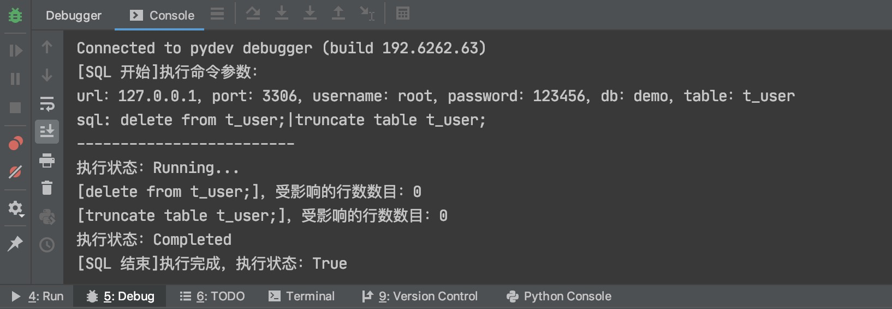

# mysql-run-with-excel

通过按照Excel约定执行SQL语句的小工具。

注意事项如下：

1. Cell内容为：`数据库连接地址`、`数据库端口号`、`用户名`、`密码`、`表名`、`执行SQL`必须存在，且分别位于第一和第三行，行位置不能改动，列位置可随意。
2. 每个Sheet不得少于4行（第一行：数据库表头、第二行：数据库配置、第三行：数据库表表头），否则认定Sheet页不按规则配置。
3. Sheet页名称为数据库名称，多个数据库表通过Sheet隔离，切记不可填写错误。
4. 脚本执行完成后，会回填每个table的`完成状态`，状态值为：True、False。
5. 执行多条SQL语句，语句通过`|`进行字符串拼接。

